## Design decisions

### Color palette and font

In our initial discussions, some adjectives we used to describe our desired app design were "attentive", "stable", and "assertive". With this in mind, we decided on a color palette from the exercise following Dr. Milburn's lecture labeled "minimal yet warm" (number 19 on [this list](http://visme.co/blog/website-color-schemes)), which includes a pale eggshell (\#EAE7DC), a warm grey (\#8E8D8A), and a rustic tan (\#D8C3A5). We also chose the sans serif font Montserrat as we felt it reflected the desired adjectives as well.

In the picture above, we used eggshell for the background, tan for the header, and grey for the new task text.

## Alternate designs

We considered a few other color palettes (numbers 37 and 50) and some other fonts, but these design decisions were surprisingly easy. There was some more discussion about alternate designs for the overall format of the app. How do we allow the user to create a new task: is it another element in the list or a floating button at the bottom of the screen? Where should we place the buttons to manage completed items: at the top of the list (so scrolling down removes them from display), or floating, or in the header? 

## User Testing

We had 3 people test our app, none of whom have taken this class, or have notable design experience. All three said they enjoyed their experience and felt that the app was simple and intuitive. They did ask if the color of the header could be different, and we changed it to a slightly more orange hue. However, upon doing this, the new color did not look as good to almost everyone, and so we changed it back.

## Final Design

### Header

We leveraged the common design metaphor of a header on a mobile application; though the header is the first item on the screen, it is understood that the main content of the page is below in the main container. We have actions listed in the header (showing/hiding or deleting completed items) along with the title/name of "Tasks".

We have added a sorting button, which opens to a drop-down menu where the user can select a method to sort by. We also added the feature of text displaying the current sorting method, which is only present when the screen is more than 800 pixels wide.

### Icons

To indicate the possible actions of our app, we used icons from Font Awesome. The specific icons used were `circle`, `circle-check`, `pen-to-square` `eye`, `eye-slash`, `trash-can`. While we didn't think all of these were perfect icons (for example, `pen-to-square` could have been a simple plus sign or just a pen), we believed these were the best free options available to us.

### Task Priority
In order to give users the ability to distinguish their tasks based on their importance, we implemented a prioritization system that has 3 levels of importance. In the spirit of our app's simplistic theme, we decided to communicate each level of importance by an exclamation point (!) symbol. That is, one exclamation point means lowest priority, two means medium priority, and three means highest priority. We displayed the priority level button at the far right of each task item, and the user can change the priority level by clicking on the button (only when editing the task, preventing the priority of tasks from being accidentally toggled). Doing so cycles through the different priority levels, and their corresponding number of exclamation points.

Example of tasks sorted by priority:

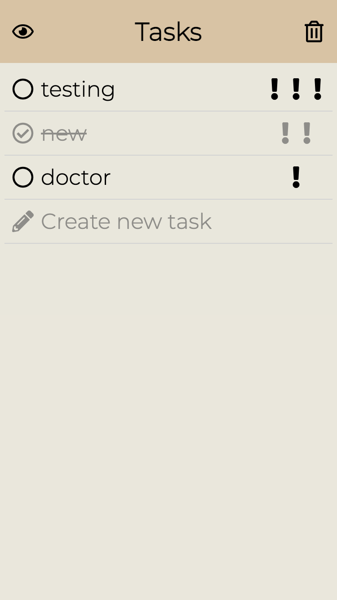

### Task Sorting
Another added feature is the ability to sort the task list by name (alphabetically), date of creation, and priority. We determined through user testing that a sorting icon placed in the header bar above the task text was intuitive and fit in with the design of the rest of the app. The sorting icon opens up a drop down menu from the icon that contains the options for sorting by date, name, and priority. Tapping on these buttons will sort the list and close the dropdown menu.

Picture of sorting button being clicked, revealing drop down menu:

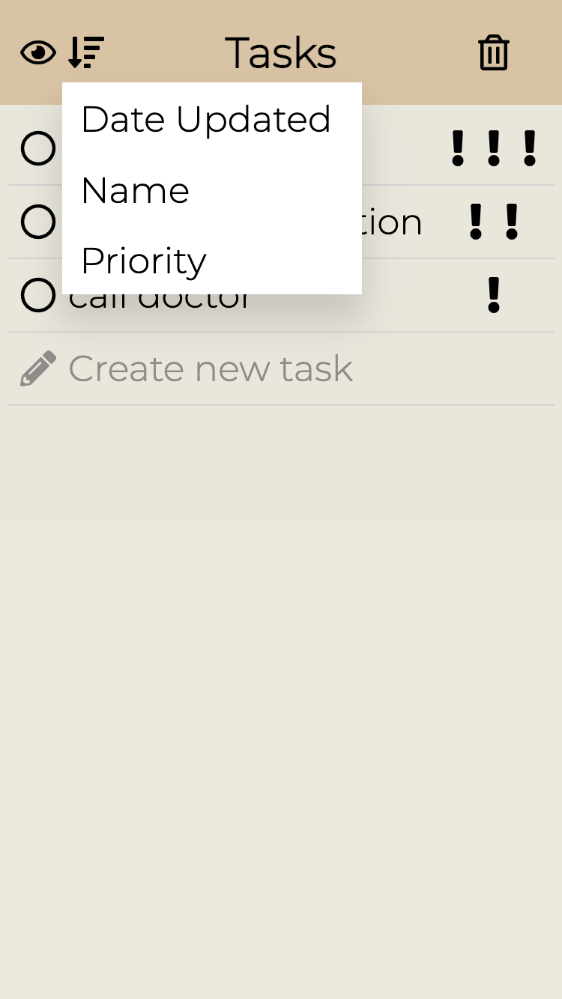

### Delete Confirmation

We figured it would be best to include a warning modal to make sure users dont accidentally delete all completed items by tapping the trash button. So, when the trash icon is pressed, a warning box comes up at the bottom asking if the user is sure they want to delete all completed items.

Delete confirmation pop-up:

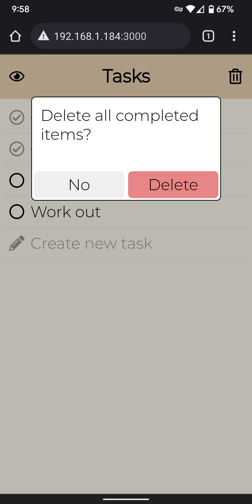

After confirming delete:

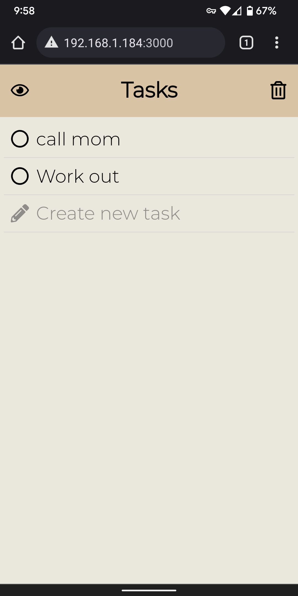

### Tabs

In the lab 4 iteration of our app, we added the major feature of multiple possible containers of task lists, in the form of tabs. These tabs, each having a list container, can be added, deleted, and switched to. The user also names the tab when they create a new one. We figured the most natural place for these tabs to be is the bottom of the app display, as there was a lot of empty space there. If the user adds too many tabs that don't fit in the screen size, then they can scroll horizontally to access the rest of the tabs.

App with a non-empty tab selected:

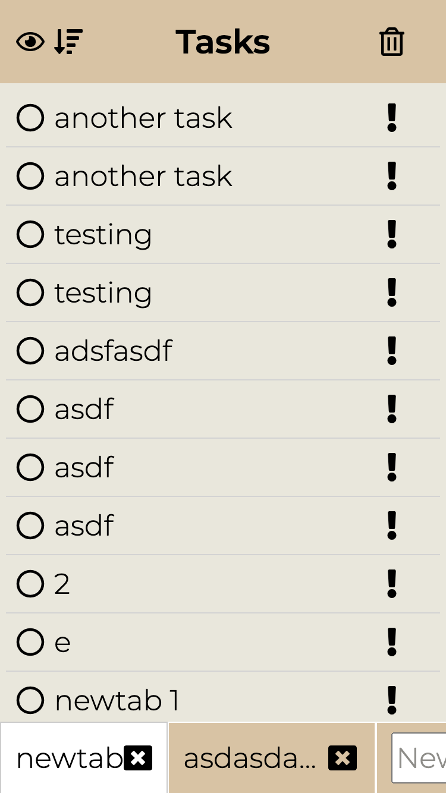

App on a newly-made tab, also featuring scrollability:

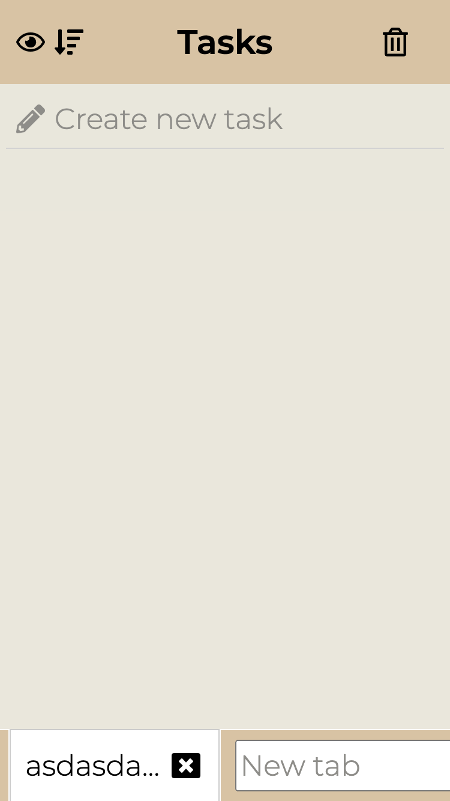

### Misc. Features

We added features to make our app more accessible on a computer. This includes being able to navigate the app through keyboard only, using TAB and ENTER, and also making sure every element has screen-reader support.

#### ACCESSIBILITY VIDEOS:
Keyboard-only Functionality: https://drive.google.com/file/d/1m7Z_klUEY01fCF8dIQbMxEMVs8KjsfY-/view?usp=sharing

Screen Reader Functionality: https://drive.google.com/file/d/12YwhgridT6olv6UI99Uj3pvjLTD9vk26/view?usp=sharing (NOTE: Our screen recorder could not record both the display and computer audio at the same time, only an external microphone, so the screen reader can't be heard, but the box for it is proof that it works).

### Tasks

Before creating a new task:

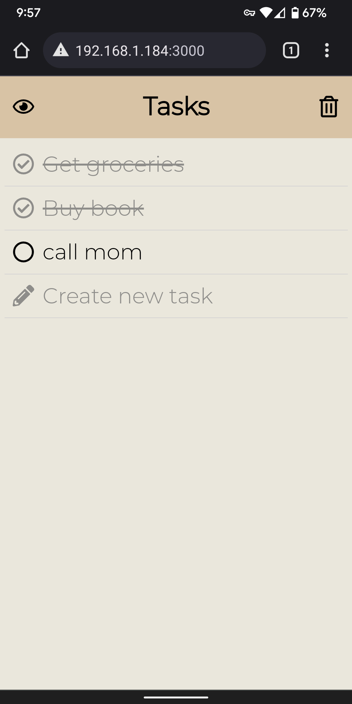

While typing in new task:

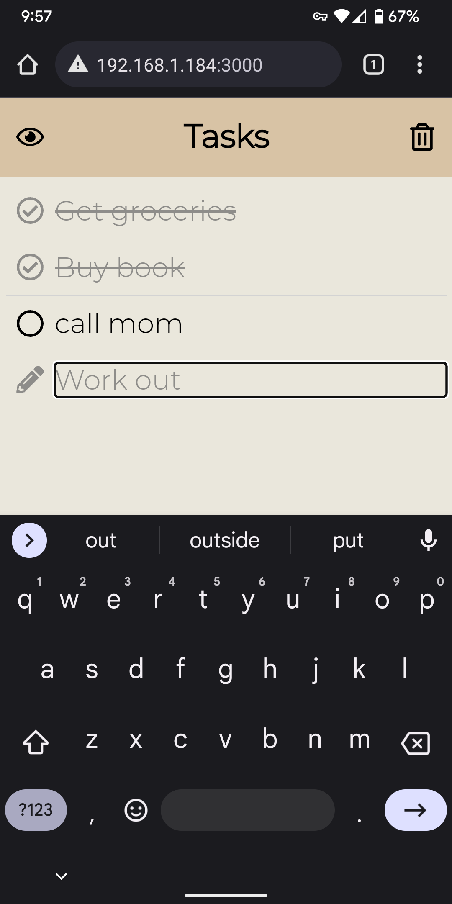

After unfocusing new task input:

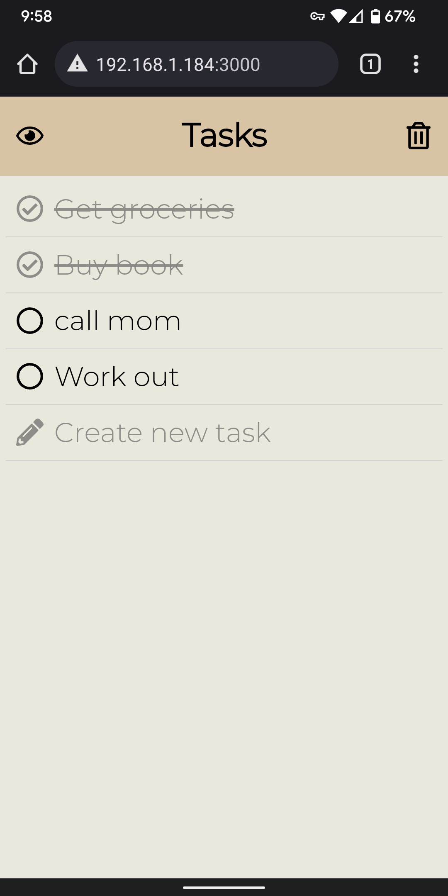

Clicking eye icon:

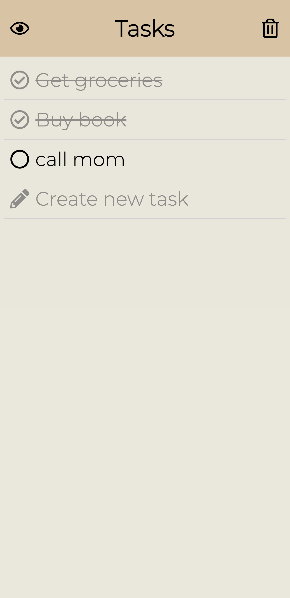

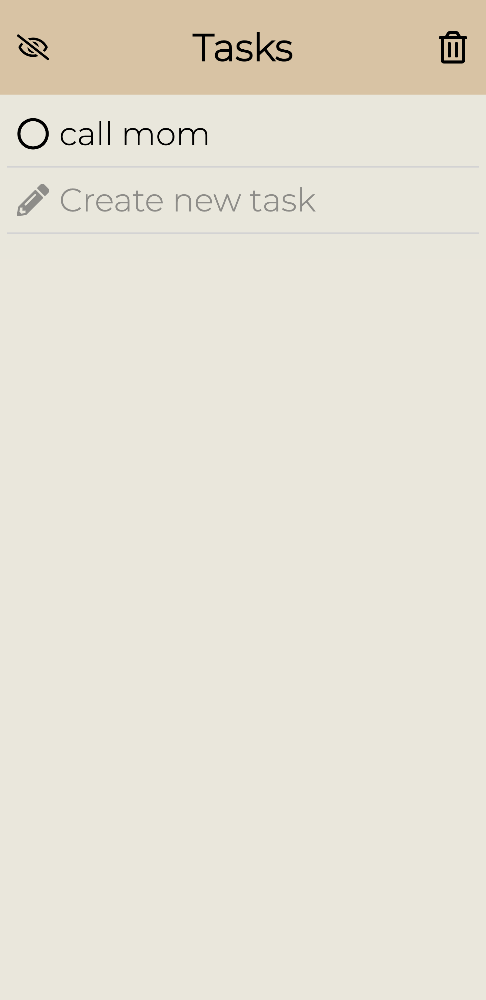

### Authorization (NEW FEATURE)

One of the final features we wished to implement was authorization, so that a user must log in in order to see their tasks. This feature also allowed the possibility of sharing task lists between users (which we'll elaborate more on in the next section). Our login scheme consisted of signing in with an email, which could be done just through our App's database or with Google. Going through our app would require them to first sign up with an email and password. These features meant we had to initiliaze the app on a login screen, that would reveal the app with the user's task lists when succesfully logged in.

### Sharing (NEW FEATURE)

In being able to log into an account, we gave users the ability to privately view and edit only their own task lists, and this also opens up the opportunity for a user to privately share task lists with another user, and gives them editing ability. Here are the rules of our sharing system:

+ If person A shares a tab with person B, that tab appears in person B's list of tabs at the bottom
+ If person B deletes the tab shared by person A, then that tab is removed from person B's list, but still present in person A's list
+ If person A deletes the tab they shared with person B, then that tab is removed from both person A's and person B's lists
+ Person B can share the tab owned by person A with person C. If person B delete the tab from their list of tabs, they are the only ones it is unshared with. Person C still has access. Essentially, only person A (the owner) can globally delete the tab from everyone's tab list. 

## Challenges

### Technical issues

While most of the development was smooth, we had some trouble correctly including the new font Montserrat and our icon package Font Awesome. We also struggled with aligning the text and icons together correctly.

### Icons

As stated above, we spent some time debating how to best represent the actions a user in our app could take. With a limited screen size, we didn't want to use lots of text as that could potentially distract from the main point of the application - making a list of tasks. We decided that icons could be useful, and then had to decide what icon package and which icons to use.

### Header design

We weren't sure initially how to fit two buttons into the header with the constraint of our screen size: we wanted the buttons for showing only uncompleted items and deleting all completed items to be visible no matter the user's position on the list (if they've scrolled down), but the header was not very wide. Fortunately, placing two icons with normal text size in the header didn't feel too cramped. 

## Favorite parts

We really think the color palette and font both capture our intent with this design; it's calm yet practical, reassuring, and even reminiscent of a traditional notepad. We also think the feature of the new task being blurred after we press enter on the task item. Task lists can certainly be imposing and urgent, aggressively reminding the user of things they need to do immediately, but we wanted ours to be more relaxed and controlled.
